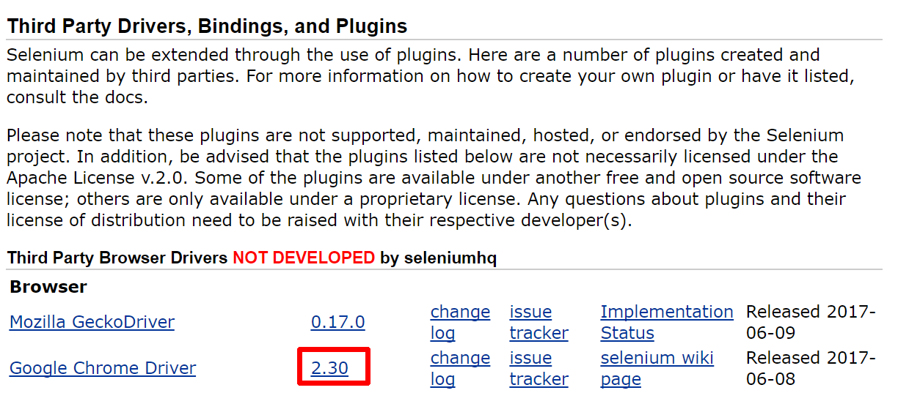
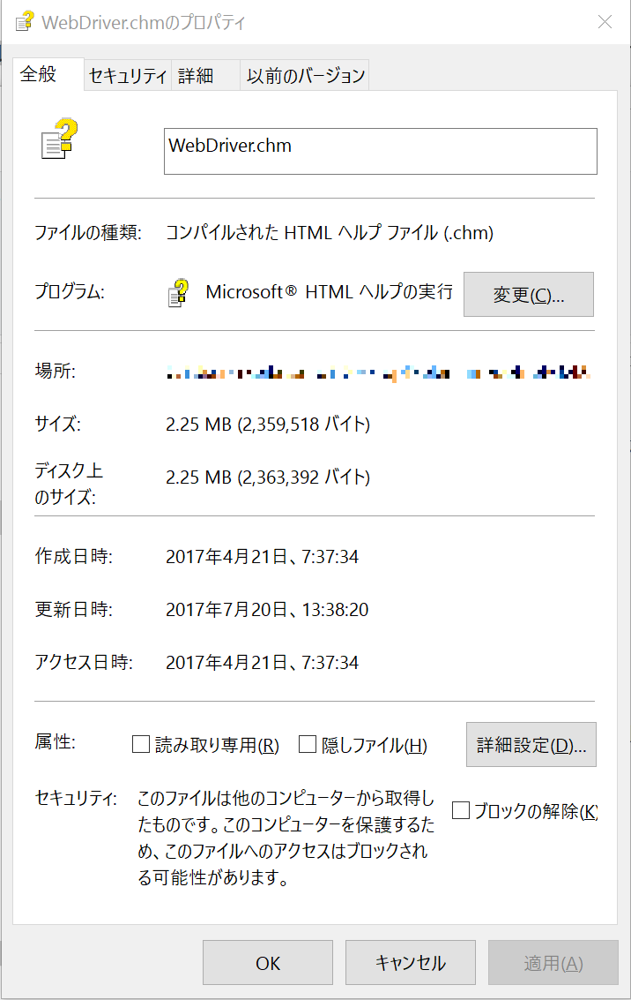
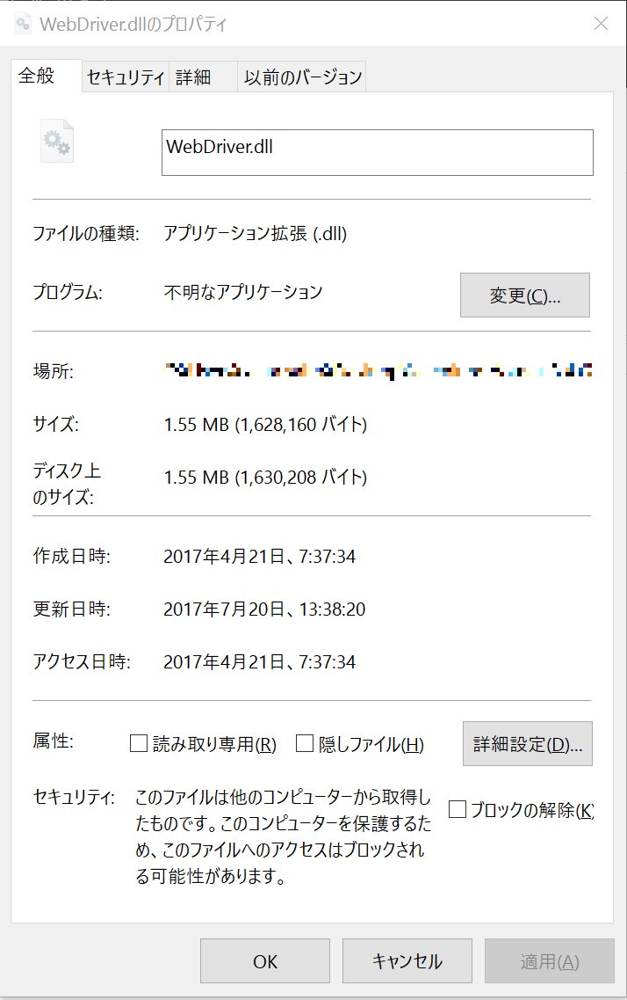
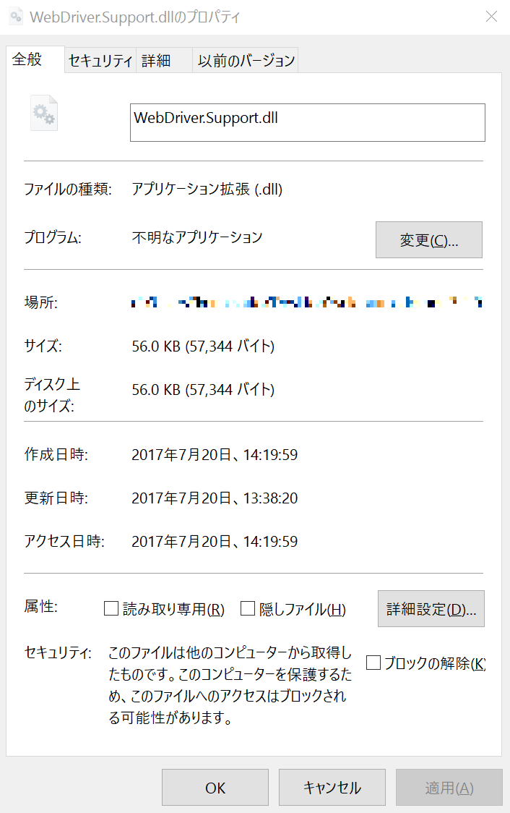
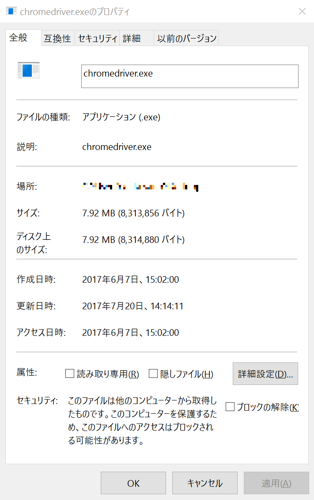
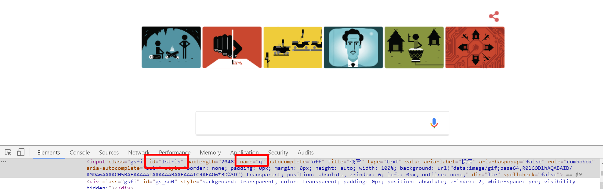

# 🔰SeleniumをPowershellから触ってみる

## 🔰Seleniumの公式サイト

- [SeleniumHQ](http://docs.seleniumhq.org/)

## 🔰Seleniumのgithubリポジトリとかユーザマニュアルとか

- [github SeleniumHQ/selenium](https://github.com/SeleniumHQ/selenium)
- [User Manual](http://docs.seleniumhq.org/docs/)
- [New Handbook (work in progress)](https://seleniumhq.github.io/docs/)

## 🔰各言語のAPIドキュメントへのリンク

- [C# API DOCUMENT](http://seleniumhq.github.io/selenium/docs/api/dotnet/)
- [JavaScript API DOCUMENT](http://seleniumhq.github.io/selenium/docs/api/javascript/)
- [Java API DOCUMENT](http://seleniumhq.github.io/selenium/docs/api/java/index.html)
- [Python API DOCUMENT](http://seleniumhq.github.io/selenium/docs/api/py/)
- [Ruby API DOCUMENT](http://seleniumhq.github.io/selenium/docs/api/rb/)

## 🔰Seleniumとは

- CIツール
- ブラウザのコントロールができる
- 対応言語はJava, C#, Python, Ruby, Perl, PHP
- webのUIテスト自動化によく使われているらしい
- なんか過去の経緯から色々種類があるけれど、とりえあずSelenium WebDriverを使えばよさそう

サポートしている環境や言語、ブラウザの詳細については[SeleniumHQ - Platforms Supported by Selenium](http://www.seleniumhq.org/about/platforms.jsp#browsers)を参照

## 🔰PowershellからSeleniumを触る？

対応言語にPowershellとは書いていませんが。

C#用と書いてる.NetのdllをPowershellからも利用出来るのでPowershellから触ってみることとする。

## 🔰Seleniumのセットアップ

今回試した環境

- 操作するブラウザはchrome
- OSはwindows10
- PowershellのVersionは5.1.14393.1480を利用
- ローカルマシンでクライアントからwebdriverを直接使う（Selenium Standalone Serverは使用しない）

[Selenium - download](http://www.seleniumhq.org/download/)

### 🔰Selenium Client & WebDriver Language Bindings の C# をダウンロード


### 🔰Google Chrome Driverのダンロード

Third Party Drivers, Bindings, and Plugins の Google Chrome Driverからダウンロードページに飛べるので利用環境のあった物をダウンロード  


ダウンロードしたファイルを適当な場所に解凍する。
（本資料ではC:\tools\seleniumというディレクトリにファイルを格納した）

本資料で利用するのは

selenium-dotnet-3.4.0.zip

    - WebDriver.chm
    - net40\WebDriver.dll
    - net40\WebDriver.Support.dll

chromedriver_win32.zip

    - chromedriver.exe

なお下記のようにセキュリティの所でブロックされている場合。
ファイルの読み込みがブロックされて正常に動かないためそれぞれブロックの解除にチェックをいれて制限解除を行う。  

▶WebDriver.chmのブロックの解除


▶WebDriver.dllのブロックの解除


▶WebDriver.Support.dllのブロックの解除


▶chromedriver.exeのブロックの解除


今回はwebサイトからダウンロードして導入しましたが、NuGetとかにパッケージが存在するようなのそちらで導入しても問題ないです。

ダウンロードページにあるSelenium Standalone Serverは複数のマシンでリモートにwebdriverに実行を書ける時に必要そう。ローカルマシンで実行を行う場合は基本必要なさそう。

## 🔰Seleniumのリファレンスガイド

ダウンロードしたファイルの中に、WebDriver.chmファイルがあり。
各クラスで用意されている機能や使い方が記載されているのでこれを見て実装していけばOK。

もしくは上にも書きましたがAPIドキュメントへのリンクが書いてあるのでこれを見て下さい。
（githubリポジトリのreadme.mdに各言語のドキュメントへのリンクがあったのでがこれを記載している）

今回利用しませんがSelenium.WebDriverBackedSelenium.dllの説明も書いてあります。

## 🔰part1.PowershellからWebDriver.dllを利用してchromeを起動してみる

```Powershell

$webDriverDllPath = "C:\tools\selenium\WebDriver.dll"
$chromeDriverDirPath = "C:\tools\selenium\"

#dll読み込み
Add-Type -Path $webDriverDllPath

#chrome起動
$chromeDriver = New-Object OpenQA.Selenium.Chrome.ChromeDriver($chromeDriverDirPath)

#URL開く
#chromeDriverクラスのプロパティにurlというRemoteWebDriverを継承したプロパティがあるので利用
$chromeDriver.Url = "https://msdn.microsoft.com/ja-jp/"

```

上記スクリプトでchromeが起動してmsdnのサイトが開く

> $chromeDriver = New-Object OpenQA.Selenium.Chrome.ChromeDriver($chromeDriverDirPath)

ChromeDriverクラスをインスタンス化して、このオブジェクトを通してブラウザを操作するようです。

## 🔰part2.入力ボックスに入力してみる

```Powershell

$webDriverDllPath = "C:\tools\selenium\WebDriver.dll"
$chromeDriverDirPath = "C:\tools\selenium\"

#dll読み込み
Add-Type -Path $webDriverDllPath

#chrome起動
$chromeDriver = New-Object OpenQA.Selenium.Chrome.ChromeDriver($chromeDriverDirPath)

#URL開く
#chromeDriverクラスのプロパティにurlというRemoteWebDriverを継承したプロパティがあるので利用
$chromeDriver.Url = "https://www.google.co.jp/"

#id or name　で要素を取得してみる
#今回はgoogle.co.jpの入力エリア(name q , id lst-ib)を探してみる。

#findElementByNameで要素を取得してみる
$inputBox = $chromeDriver.findElementByName("q")

#取得できた要素にSendKeysで入力を渡す
$inputBox.SendKeys("HelloWorld by findElementByName")

#HelloWorldほにゃららと書き込まれたことの目視確認用に待機
Start-Sleep -Seconds 5

#inputboxをクリア
$inputBox.clear()

#findElementByIdで要素を取得してみる
$inputBox = $chromeDriver.findElementById("lst-ib")

#取得できた要素にSendKeysで入力を渡す
$inputBox.SendKeys("HelloWorld by findElementById")

```

chromeブラウザの開発者モードとかで要素を確認すると便利。

google.co.jpの検索ボックスの name は q , id は lst-ib  


上記のような感じでchromeが起動した後に、名前やidを元に要素を取得し。
それに対して色々と操作をしていくことでブラウザの操作が出来たりする。

リファレンスをみると

FindElementByPartialLinkTextとかパーマネントリンクテキストで検索したり。
FindElementsByXPathとかxpathで検索したり。
OpenQA.Selenium.Interactionsクラスとかオフセット指定でマウスを操作できたりだとか。

色々とできる様子。

## 🔰part3.WebDriverWaitクラスを使ったwait処理

ページの読み込み処理等でStart-Sleepとかやってもいいですが。
WebDriver.SupportにWebDriverWaitというクラスが用意されているのでこれを利用する。

```Powershell

$webDriverDllPath = "C:\tools\selenium\WebDriver.dll"
$WebDriverSupportDllPath = "C:\tools\selenium\WebDriver.Support.dll"
$chromeDriverDirPath = "C:\tools\selenium\"

#dll読み込み
Add-Type -Path $webDriverDllPath
Add-Type -Path $WebDriverSupportDllPath

#chrome起動
$chromeDriver = New-Object OpenQA.Selenium.Chrome.ChromeDriver($chromeDriverDirPath)

#URL開く
#chromeDriverクラスのプロパティにurlというRemoteWebDriverを継承したプロパティがあるので利用
$chromeDriver.Url = "https://www.google.co.jp/"

"name qのテキストボックスに HelloWorld と入力してsubmit
$chromeDriver.findElementByName("q").SendKeys("HelloWorld")
$chromeDriver.findElementByName("q").submit()

#WebDriverWaitクラスのインスタンス化
#chromeDriverとSystem.TimeSpanスパンでタイムアウトまでの時間を指定している
$webDriverWait = New-Object OpenQA.Selenium.Support.UI.WebDriverWait($chromeDriver , (New-TimeSpan -Seconds 10))

#WebDriverWaitクラスはuntilメソッドにOpenQA.Selenium.Support.UI.ExpectedConditionsを渡してあげると条件を満たすまで待ってくれる。
#TitleContainsは指定して文字列がタイトルに含まれるまで待機
#submit後、タイトルに検索文字列が含まれるまで待機
$webDriverWait.until([OpenQA.Selenium.Support.UI.ExpectedConditions]::TitleContains("HelloWorld"))

```

[C# WebDriverWait Class](http://seleniumhq.github.io/selenium/docs/api/dotnet/?topic=html/T_OpenQA_Selenium_Support_UI_WebDriverWait.htm)

[C# ExpectedConditions Class](http://seleniumhq.github.io/selenium/docs/api/dotnet/?topic=html/T_OpenQA_Selenium_Support_UI_ExpectedConditions.htm)

WebDriverWait　と　ExpectedConditions については上記ドキュメントを参照

今回はTitleContainsを利用したが、他にも色々な条件でwaitを書ける事が出来るのでドキュメンを見れば幸せになれるかも！？

## 🔰Part4.ブラウザの終了と破棄

closeとdisposeを使ってchromeDriverの終了処理

```Powershell

$webDriverDllPath = "C:\tools\selenium\WebDriver.dll"
$WebDriverSupportDllPath = "C:\tools\selenium\WebDriver.Support.dll"
$chromeDriverDirPath = "C:\tools\selenium\"

#dll読み込み
Add-Type -Path $webDriverDllPath
Add-Type -Path $WebDriverSupportDllPath

#chrome起動
$chromeDriver = New-Object OpenQA.Selenium.Chrome.ChromeDriver($chromeDriverDirPath)

#chromeDriveのプロセスが起動していくことの確認
Get-Process chromedriver

#5秒待機
Start-Sleep -Seconds 5

#ブラウザを閉じる & 破棄
$chromeDriver.quit()

#プロセスが終了していることの確認
Get-Process chromedriver

```

## 🔰総評

色々と出来るようですが作り込もうとするとそこそこ時間が取られるので、ある程度利用が見込まれる物を作り込んでいくのが良さそうですね。

Sikuli(画像認識を使ったGUI操作ツール)と組み合わせて利用されている例もあるみたいですね。
